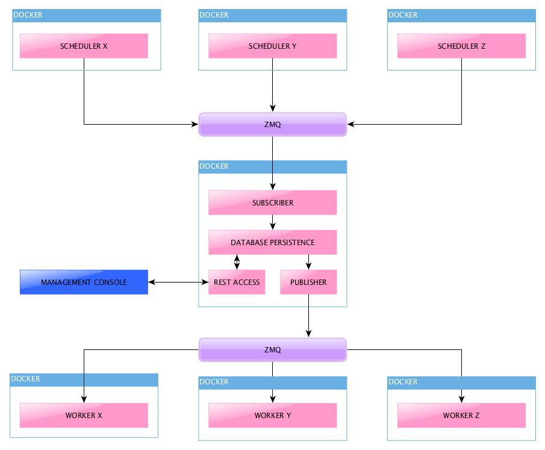

# dist-sched-tasks
Distributed Scheduled Tasks framework implementation

## Introduction
More often we need a generic scheduled tasks executor that needs to be fail-safe, reliable and scalable. This is just a framework that aims at tacking the problem.

## Architecture

### Scheduler
Schedulers are the starting point of the process. Each scheduler maintains a list of jobs that needs to be executed at a given time. Instead of spawning the tasks at the scheduled time, scheduler enqueues a message to the Task Queue with the necessary input configuration for the task and the time at which the task should be executed
### Task Queue
Task Queue stores the job queue in a persistent storage, to alleviate the short-comings of in memory queue. It also provides a HTTP interface to manage the queue for administrative tasks. It may implement de-duplication logic on the subscriber side, cleanup logic for queue, and a time based prioritization logic to distribute work to the downstream consumers

### Processor
Processors may implement a specific or all of the tasks. Each worker will register its capabilities during boot up so that it can listen on and process the messages that only it can process. These workers can be made as a docker swarm and can be distributed over a cluster of nodes for high scalability.

## Technology Stack
* docker
* Python 3.x

## Customization
### Scheduler
1. Subclass the [Task](scheduler/scheduler/common/task.py) class as implemented in [CookTask](scheduler/scheduler/tasks/cook.py) with your own implementation.
2. Make sure you give an unique name to the task and generate a schedule ( in epoch timestamp format ) and config required for the task. The `enqueue()` method needs to be called to enqueue the task
3.  Then add it to the main [scheduler](scheduler/scheduler/scheduler.py) with the frequency of scheduling.
4. Change the IP address `TASK_ENQUEUE_URL` in [appconfig](scheduler/scheduler/conf/appconfig.py) to where the taskq will be running
5. Build and run the docker containers using the scripts provided on the [scheduler](scheduler) directory

### Processors
1. Subclass the [Task](processor/processor/common/task.py) with your own implementation as in [CookTask](processor/processor/tasks/cook.py)
2. Make sure you indicate the status of the task after processing by either calling `success()` or `failure()` method. Optionally, pass in any result if you want it to be recorded.
3. Add the implementation to the `CAPABILITIES` and `IMPLEMENTATIONS` in main [processor](processor/processor/processor.py)
4. Change IP address of `TASK_REQUEST_URL` and `TASK_UPDATE_URL` as mentioned above in (appconfig)[processor/processor/conf/appconfig.py]
5. Build and run the docker containers using the scripts provided on the [processor](processor) directory

### Note
You can choose to run multiple schedulers and processors in same docker or build different images for each task.

## Todo List:
1. Admin API to manage tasks
2. Implement HTTPS for more security
