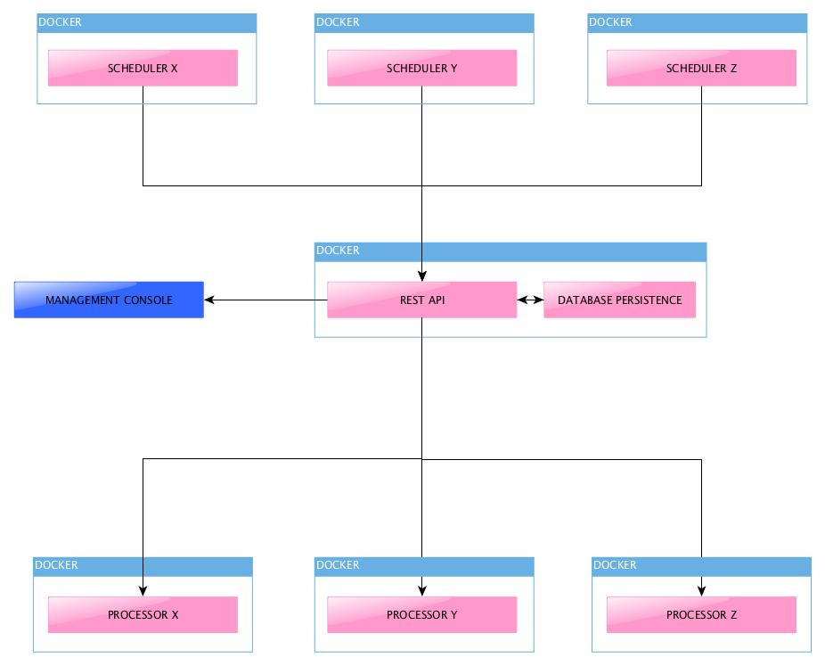

# dist-sched-tasks
Distributed Scheduled Tasks framework implementation

## Introduction
More often we need a generic scheduled tasks executor that needs to be fail-safe, reliable and scalable. This is just a framework that aims at tacking the problem.

## Architecture

### Scheduler
Schedulers are the starting point of the process. Each scheduler maintains a list of jobs that needs to be executed at a given time. Instead of spawning the tasks at the scheduled time, scheduler enqueues a message to the Queue Manager with the necessary input configuration
### Queue Manager
Queue Manager stores the job queue in a persistent storage, to alleviate the short-comings of in memory queue. It also provides a HTTP interface to manage the queue for administrative tasks. It may implement de-duplication logic on the subscriber side, cleanup logic for queue, and a time based prioritization logic to distribute work to the downstream consumers

### Workers
Workers may implement a specific or all of the tasks. Each worker will register its capabilities during boot up so that it can listen on and process the messages that only it can process. These workers can be made as a docker swarm and can be distributed over a cluster of nodes for high scalability.

## Technology Stack
